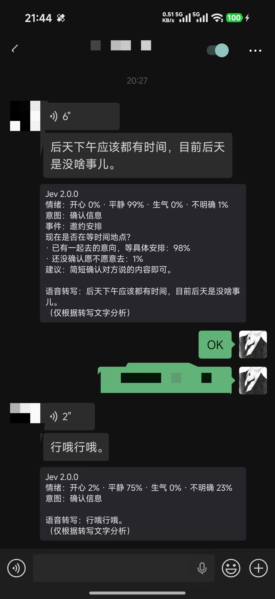
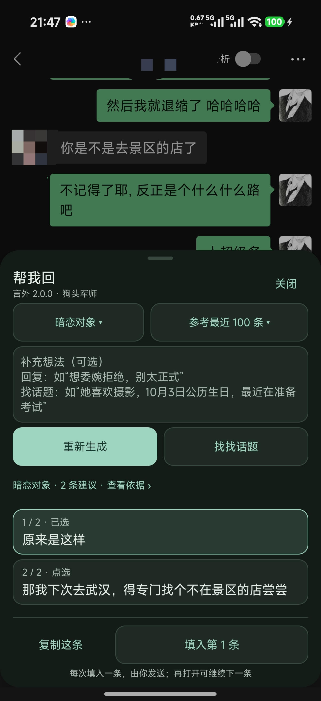
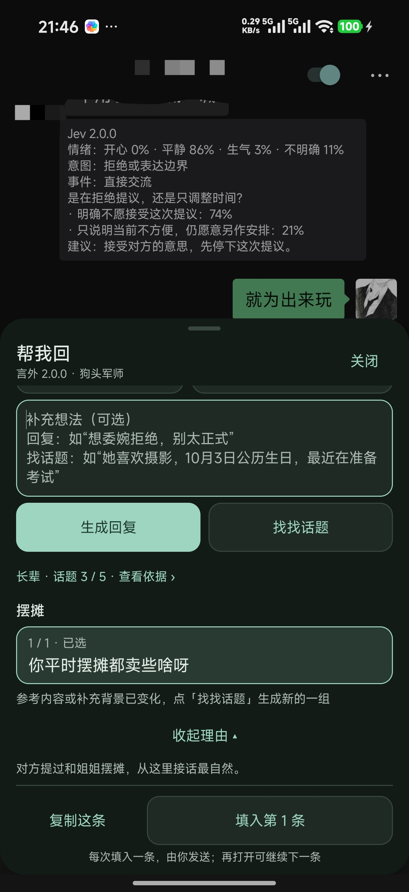

<div align="center">

# 言外 · Yanwai

**读懂一点言外之意，也帮你把下一句话说出来。**

微信里的聊天助手：理解文字和语音，参考上下文生成回复，聊不下去时找个新话题。


[使用效果](#使用效果) · [功能介绍](#功能介绍) · [开始使用](#开始使用) · [接口配置](#接口配置) · [2.1.7 更新说明](docs/releases/2.1.7.md)

</div>

> 言外免费开源，不会自动发送微信消息。需要 Android 9+ 和可用的 LSPosed / Xposed 环境；模型服务使用你自己的 API Key。

## 使用效果

下面是作者提供的 **2.0.0 实机截图**，点击可查看原图。

<table>
  <tr>
    <th width="33%">语音也能分析</th>
    <th width="33%">结合前文，帮我回</th>
    <th width="33%">接不下去，找找话题</th>
  </tr>
  <tr>
    <td valign="top" align="center"><a href="docs/images/v2-voice-analysis.jpg"></a></td>
    <td valign="top" align="center"><a href="docs/images/v2-reply-assistant.jpg"></a></td>
    <td valign="top" align="center"><a href="docs/images/v2-topic-suggestions.jpg"></a></td>
  </tr>
  <tr>
    <td>先转文字，再分析情绪与意图；正文留在卡片里，方便核对。</td>
    <td>选择关系、参考条数和补充想法，把建议分成日常聊天的短消息。</td>
    <td>从真实前文延伸话题，查看理由，选中一句复制。</td>
  </tr>
</table>

截图来自 2.0.0，其中的填入按钮已于 2.1.1 移除，当前只保留复制。截图展示了这些场景在作者设备上的使用效果，不代表所有微信版本、群聊或历史语音场景都已验证。完整范围见[语音支持](docs/VOICE_SUPPORT.md)和[验证记录](docs/VERIFY.md)。

## 功能介绍

### 看懂这句话：情绪与意图解读

“后天下午有时间”可能是在确认安排；“今天算了吧”可能是在表达边界。言外结合前文与消息发送时间，把可能的理解放在原消息下，供你判断下一步怎么回应。

- **情绪概率**：展示开心、平静、生气和不明确等概率，不把推测写成确定结论。
- **两条意图线路**：默认 JEV 决策模型，从内置选项快速判断；也可选智能分析（通用大模型），结合前文解释意图、可能在意的点和情绪倾向。LLM 通常更慢，也可能误读，不保证更准确；这条线路不生成回应建议。两种线路的情绪概率始终由 JEV 提供。
- **深色透明卡片**：用小圆环和固定配色显示情绪概率，环内有百分比、旁边有情绪名；紧凑短句解读放在原消息下方，不显示长条。背景模糊不可用时退回半透明样式，文字保持清晰。新样式尚待实机验收，上方截图仍为 2.0.0。
- **意图与场景分开判断**：区分确认信息、提问、拒绝、道歉、感谢、澄清等意图，再结合邀约、倾诉等场景。43 套分析卡覆盖日常沟通及焦虑、困惑、疲惫等表达。
- **结合时间和前文**：参考目标之前双方的文字与语音，保留原发送时间和间隔。最多扫描 80 个页面位置、保留 24 条，转写后总长不超过 12000 字符；不引用目标之后的消息。
- **JEV 线路两轮复核**：第二轮复核情绪、意图和建议前提。识别到暂停或拒绝时，不继续给出劝说建议；依据不足时可以只展示情绪。LLM 线路只向 JEV 请求情绪，再由 LLM 独立解读；失败时保留情绪并可点击重试。
- **自动或单条，由你选择**：右上角「分析」只控制当前联系人或群聊，默认关闭并记住选择。也可长按对方消息「翻译意图」，只分析这一条，不打开自动分析。

### 语音也能用：自动转写，再理解内容

开启分析或长按对方语音后，言外调用**微信原生转文字**，成功后再分析文字内容。分析前文、「帮我回」和「找找话题」参考范围内双方的语音，同样会自动准备转写。

- 已有转写直接复用，无需再配置语音模型或 Key。
- 准备时显示进度，分析卡和回复依据中可核对转写正文。
- 目标语音转写失败时不继续分析；上下文中的失败语音标明内容未知，不编造缺失内容。
- 离开聊天或取消准备，会停止本次等待和后续模型调用；已经交给微信的原生任务仍由微信管理。

**这属于转写文字分析，不是声音情绪识别**：不能凭转写判断音调、哭腔或语速。图片、视频和文件正文仍不在识别范围内。详见[语音支持与验收说明](docs/VOICE_SUPPORT.md)。

### 帮我回：参考聊天，生成自然的分条回复

打开微信聊天「＋」面板 → **帮我回** → 选择身份与参考条数 → 补充想法 → **生成回复** → 选中一句复制 → 自己粘贴并发送。

| 功能 | 使用方式 |
| --- | --- |
| 对方身份 | 可选暗恋对象、暧昧对象、恋人、朋友、长辈、家人、同事等，也可留空或自定义“前同事”“相亲对象”等身份 |
| 参考范围 | 最近 30 / 50 / 100 条文字与语音，首次默认 100 条；支持读取当前聊天的本机历史，不用先手动翻页 |
| 补充想法 | 写下“想委婉拒绝，别太正式”等目标，也可补充双方关系和近况 |
| 分条回复 | 按语意生成 1–6 条短消息；逐条选择、复制，再自行粘贴发送，适合微信里自然的停顿和接话 |
| 查看依据 | 查看建议实际参考的消息、说话人、时间和来源；历史不足时显示实际读取数量 |
| 重开继续 | 保留当前微信进程内上次成功建议和手动选中的条目；不写入聊天输入框 |

打开面板或切换条数会准备上下文，**点击生成才调用回复模型**；新消息不会自动生成回复。准备语音时可能调用微信自己的转写服务。切换聊天或关闭面板会取消未完成请求，成功建议在微信进程结束后清空。

### 找找话题：从聊天里找一个接得上的开场

不确定下一句聊什么，点「生成回复」旁的 **找找话题**。它使用同样的聊天、身份和补充想法，一次准备 **5 个话题**，每个话题包含 1–3 句口语开场和可展开的理由。

- 点「换个话题」先在本组未看过的话题中切换，看完后再请求新的一组，减少重复调用。
- 参考当前日期、时间、星期及近期节日；你也可以补充生日、兴趣和最近在忙的事情。
- 话题里的短句同样可逐条复制，再自行粘贴发送；五个话题是备选方向，不是让你一次全发。
- 身份、上下文或补充想法变化后，需要重新生成，不把旧话题当成新背景下的建议。

### 情绪判断与回复模型，分别配置

设置页分为 **聊天分析 / 回复建议 / 关于言外**。情绪 JEV、意图 LLM、回复 LLM 分别保存配置，**只想使用「帮我回」也可以只配回复模型**。

「聊天分析 → 意图怎么分析」选择并保存线路。JEV 模式隐藏 LLM 表单；LLM 模式展开供应商、Key 和模型配置，已配置的 JEV 收起，需要时点「查看 / 修改 JEV 配置」。LLM 支持获取模型列表、手填模型 ID 和示例意图检测。保存后才切换微信线路，原有聊天自动开关仍默认关闭。

- 情绪判断使用 Jev，支持官方 TypeSafe、OpenRouter、Vercel AI Gateway 及 Jev 兼容接口。
- 回复和找话题支持豆包、小米 MiMo、DeepSeek、OpenAI GPT、智谱 GLM、Kimi，以及自定义 OpenAI 兼容接口。
- 回复模型支持获取列表、筛选选择和手动填写；各供应商的地址、Key、模型分别保存。
- 微信「我 → 设置」的插件分组提供「言外设置」入口；也可从桌面应用或长按聊天顶部「分析」打开。

回复方法参考开源项目 **[狗头军师 goutoujunshi](https://github.com/shengjidaguai-china/goutoujunshi)**，按关系选取沟通知识，再由你配置的模型生成建议。随应用保留原作者 Copyright (c) 2026 powerycy 和 MIT 许可。配置细节见[回复建议说明](docs/REPLY_ASSISTANT.md)。

言外不会自动回复或发送微信消息。分析和建议只是理解对话的辅助，不能代表对方的真实想法，也不替你作出决定。

## 开始使用

### 使用条件

- Android **9 或更高版本**。
- 已配置可用的 **LSPosed / Xposed** 环境；仅安装 APK 不会自动生效。
- 所需功能对应的 **API Key** 和可访问接口的网络：情绪判断使用 Jev 渠道，回复和找话题使用回复模型渠道，两者可以分别配置。
- 项目已有实机记录的微信版本为 **8.0.71**，其他版本的界面适配需实际验证。

### 安装与配置

1. 从 [GitHub Releases](https://github.com/YIRC99/yanwai/releases) 下载并安装 APK，先从桌面打开一次 **「言外」**。
2. 按需要配置功能：在「聊天分析」连接 JEV 并选择意图线路，选择 LLM 时再填写独立 Key 和模型、保存检测；在「回复建议」选择供应商、填写 Key 和模型，开启「允许手动生成回复建议」后保存检测。分析与回复不必同时开启。
3. 在 LSPosed 中启用模块，作用域选择 **微信**。
4. **彻底退出并重新打开微信**。更新 APK 后也需要重启微信进程。
5. 使用情绪判断时，在聊天右上角开启「分析」，或长按单条消息「翻译意图」。每个联系人、群聊默认关闭，开启后会在本地记住。
6. 使用回复或找话题时，在聊天「＋」面板打开「帮我回」，等参考内容准备好后再点生成。无需先开启自动分析。

源码构建出的试用包位于 `app/build/outputs/apk/debug/app-debug.apk`，构建步骤见下文。

微信已加载设置后，可以划掉最近任务中的「言外」，当前微信进程会保留设置，已由用户在手机上确认可用。微信自身重启后仍需重新读取设置，若连接失败请打开一次言外。其他机型仍需验证，机制与验收步骤见[后台运行说明](docs/BACKGROUND.md)。

### 常用操作

从 1.1.2 开始，打开言外会检查 GitHub 正式新版（正常每 24 小时一次），也可点击“检查更新”。发现新版后前往 GitHub 下载 APK 覆盖安装；同一版本只自动提醒一次。无需自己的服务器。旧版用户需先手动升级以获得此功能，发布规则见[更新提醒说明](docs/UPDATES.md)。

| 操作 | 效果 |
| --- | --- |
| 开关聊天右上角「分析」 | 开启当前会话的自动分析并本地记住；主动关闭时隐藏全部分析卡、停止新请求，同时清除当前聊天的手动选择 |
| 长按对方文字或语音 →「翻译意图」 | 仅分析这条消息，语音先自动转写；在原消息下显示结果，无需开启聊天开关 |
| 点击失败的分析卡 | 重试这条消息；已有成功结果优先复用 |
| 长按「分析」 | 打开状态、分析本屏和助手设置；分析本屏会开启并记住当前会话 |
| 聊天「＋」→「帮我回」 | 准备上下文，选择身份、参考条数和补充想法，手动生成回复 |
| 「参考最近 N 条」菜单 | 选择 30 / 50 / 100 条、查看已读取内容或重新读取 |
| 「找找话题 / 换个话题」 | 准备一组 5 个话题，再在本组中切换；看完后才请求下一组 |
| 「查看依据」 | 查看当前建议实际使用的上下文，不与后来读取的新消息混淆 |
| 「复制这条」 | 只复制选中的短消息，由你自行粘贴到聊天框发送 |
| 微信「我 → 设置 → 插件 → 言外设置」 | 打开助手设置；未知微信设置结构可使用桌面或聊天备用入口 |
| 保存新的地址或 Key | 后续新请求使用新配置，已有缓存不会自动重做 |

## 接口配置

### 情绪判断：Jev

| 渠道 | 完整调用地址 | 模型 |
| --- | --- | --- |
| Jev 官方 · TypeSafe | `https://api.typesafe.ai/v1/systemone` | `jev-1.13.0` |
| OpenRouter | `https://openrouter.ai/api/v1/systemone` | `typesafe/jev-1.13` |
| Vercel AI Gateway | `https://ai-gateway.vercel.sh/typesafe/v1/systemone` | `typesafe-ai/jev` |
| 自定义 Jev 兼容接口 | 用户填写完整地址 | 按服务商填写，默认 `jev-1.13.0` |

页面随渠道展示三步申请教程、申请入口和官方接入文档。OpenRouter 无需另申请 TypeSafe Key；Vercel 需创建 **AI Gateway Key**，并按平台要求完成绑卡验证。完整教程见 [渠道与 Key 申请](docs/API_PROVIDERS.md)。

升级时会识别旧版保存的官方渠道常见地址，自动匹配 Jev 路径与模型，保留 Key。切换渠道分别保存各自的 Key，不将上一渠道的 Key 自动带到新渠道；切换后需保存生效。已有缓存不自动重做。

**「情绪模型 · JEV」的自定义服务需要兼容 Jev 专用请求与概率响应协议；普通 OpenAI 聊天接口填在意图 LLM 或「回复建议」中。** Jev 自定义完整 HTTP(S) 地址不补路径；建议使用 HTTPS，HTTP 在微信进程中受宿主策略限制。JEV 和意图 LLM 分别使用内置示例检测，不读取聊天；检测成功不代表微信模块已经加载。选择 LLM 意图线路后，分析文字与相关前文会同时用于 JEV 情绪和所选 LLM 解读。

### 回复建议与找话题：独立 LLM

选择豆包、小米 MiMo、DeepSeek、OpenAI GPT、智谱 GLM、Kimi 或自定义供应商，填写该供应商的 Key，获取模型列表后选择模型，也可直接填写模型 ID。自定义服务需兼容 OpenAI Chat Completions 接口。模型列表是候选，实际可调用性以「保存并检测回复」为准；检测使用示例聊天，会消耗自己的服务商额度。

更换供应商后保存才生效，不会自动把另一家的 Key 带过去。详细的地址格式、模型选择与问题排查见[回复建议配置](docs/REPLY_ASSISTANT.md#配置)。

## 分析范围与隐私

- 只为**当前屏幕可见的对方文字、引用后的文字回复或语音**发起情绪分析；单条正文或语音转写超过 **1000 字符**时跳过，不截断后给出结论。
- 引用回复以新回复正文为分析目标，被引用文字单独作为依据，保留其显示名，不冒充当前发送者或最近一轮发言。引用图片、文件、不可读或过长的内容时，仅标明引用依据缺失，不读取附件；普通链接、文件卡片仍不触发分析。
- 情绪分析参考目标之前最多 24 条页面文字或语音（最多扫描 80 个位置、转写后 12000 字符），不读取目标之后的消息。语音按已确定的消息身份读取微信现有转写或调用原生转写，不扩展为整段数据库历史。其他媒体和失败语音会标注缺口。
- 开启自动分析或手动点击「翻译意图」后，**目标正文、语音转写及相关前文会发送到你填写的模型接口地址**。语音转写使用微信自己的服务，可能联网，不额外配置语音模型；打开「帮我回」准备上下文时就可能触发转写，点击生成才发送给回复模型。模型不接收原始音频，不能据转写判断音调、哭腔等声音特征。
- Key 保存在应用私有设置中，关闭系统备份；仅本应用和微信进程可通过设置桥读取配置。APK 不包含用户 Key，应用状态和日志不输出 Key。
- 「帮我回」按当前聊天限量读取，最多参考 100 条文字或语音，转写后总长不超过 48000 个 UTF-16 字符。历史不可用时降级为页面消息，并显示来源与实际数量；不遍历联系人、不导出数据库。
- 回复与话题生成会把选定聊天片段、时间、说话人、身份、补充想法及当前草稿送到所选回复模型服务商。模型可能有自己的数据处理和计费规则。
- 言外不另存聊天原文、转写正文和分析结果，分析及回复缓存只在进程内存中；**微信原生转写流程可能在微信自己的数据库保存结果**。会话开关保存在微信本地私有设置中，只记录会话标识的哈希，不记录昵称或聊天内容；重启微信后保留，清除微信数据后重置。
- 手动选中的消息与结果只保留在当前微信进程内，切换聊天后返回可恢复，重启微信后清空。主动关闭顶部开关会清除当前聊天的手动选择，之后仍可重新长按单条分析。加载更多历史不会自动重做已选消息；没有可靠消息标识时不添加单条入口。
- 没有足够依据时，可以只展示情绪概率，不强行添加潜台词或通用建议。

## 开发与构建

项目使用 Kotlin、Android 原生界面、Xposed 和 DexKit。编译环境：**JDK 17+、Gradle 8.9、Android SDK 35**。

配置 `ANDROID_HOME` 或在本机 `local.properties` 中设置 `sdk.dir`，然后在项目根目录运行：

```shell
gradle :app:testDebugUnitTest :app:assembleDebug :app:lintDebug --no-daemon -Pkotlin.compiler.execution.strategy=in-process
gradle :app:assembleRelease --no-daemon -Pkotlin.compiler.execution.strategy=in-process
```

仓库也提供 Windows 快捷脚本 `tools/gradle.ps1`，目前使用作者本机的 `D:\DevEnv\Java\jdk21` 和 `D:\DevEnv\gradle` 路径，其他环境请修改路径或直接使用上面的 Gradle 命令。

版本唯一来源为 `version.properties`，顶部名称和分析卡从 `BuildConfig` 读取。每次本地提交都要升版：执行 `powershell -File tools/bump-version.ps1`，并把版本文件与改动一起暂存。首次克隆执行 `git config core.hooksPath .githooks` 启用提交检查；功能批次可加 `-Part minor`。详见[版本维护](docs/UPDATES.md)。

| 产物 | 路径 |
| --- | --- |
| 可安装的 Debug 试用包 | `app/build/outputs/apk/debug/app-debug.apk` |
| 未签名的 Release 包 | `app/build/outputs/apk/release/app-release-unsigned.apk` |

公开分发 Release 前，需用维护者自己的固定签名密钥签名。构建不读取个人 API 配置；签名文件、本机配置与临时输出已加入 Git 忽略。旧个人版 APK 曾内置 Key，不要公开分发旧包。

1.1.0 的 OpenRouter 已用真实 Key 完成三组中文样例、共六次请求的两轮分析。Vercel 已按官方接口接入并收到平台响应，当前测试账户受绑卡验证限制，尚未验证成功推理。构建及回归记录见[验证记录](docs/VERIFY.md)；自动化检查不代表所有微信版本均兼容。

## 常见问题

**只想要回复建议，必须先配置 Jev 吗？**

不必。只配置「回复建议」并开启手动生成许可即可。自动情绪分析和回复生成是独立功能。

**为什么选了 100 条，却没有读到 100 条？**

100 条是上限，不是读取成功的承诺。本机历史不足、历史接口不兼容或内容超出长度预算，都可能减少实际数量。打开条数菜单「查看已读取」，确认来源、时间和正文；旧建议的实际上下文看「查看依据」。

**语音没转出来怎么办？**

先检查微信能否正常转文字，以及语音是否仍在本机。网络、语言、音频缺失或微信版本变化都可能影响转写。失败分析卡可点击重试，回复上下文可重新读取；目标语音失败不分析，缺失上下文会明确标注。全无可用内容时不会生成回复。

**复制后会自动填入或发送吗？**

不会。2.1.1 起已移除直接填入和撤销填入功能，回复与话题都只提供复制；请自行粘贴到微信输入框、检查后发送。

**没有分析卡？**

先确认 LSPosed 已启用模块且作用域选中了微信，再彻底重启微信。检查言外是否保存了有效 Key，以及当前聊天右上角「分析」是否打开。未知消息布局会跳过，不会强行覆盖原消息。

**关闭当前聊天的分析会停止请求吗？**

会。主动关闭顶部开关会隐藏当前会话的全部结果，同时清除手动选择；排队任务和未发出的第二轮停止，正在进行的 HTTP 请求也会取消，晚到结果不再写入。取消不能保证服务商停止计算或退款。关闭后仍可重新长按某条消息，选择「翻译意图」单独分析。其他联系人和群聊不受影响。旧版两个全局开关不再生效，升级后所有未单独开启的会话默认关闭。

**为什么有时只有情绪，没有潜台词和建议？**

解读和下一步动作分别判断。没有可靠选项时只展示情绪概率，避免为了填满卡片而猜测。

**如何反馈问题？**

通过 [Issues](https://github.com/YIRC99/yanwai/issues) 提供 Android、微信和模块版本，以及复现步骤。附图和日志前请去掉私人聊天与密钥。

## 进一步了解

- [2.1.7 更新说明](docs/releases/2.1.7.md)
- [2.0.0 完整更新说明](docs/releases/2.0.0.md)
- [语音支持、兼容范围与手机验收](docs/VOICE_SUPPORT.md)
- [回复建议、找话题与模型配置](docs/REPLY_ASSISTANT.md)
- [单条消息「翻译意图」](docs/MANUAL_ANALYSIS.md)
- [分析机制与实现说明](docs/TECHNICAL.md)
- [1.3.0 架构检查与优化](docs/ARCHITECTURE.md)
- [聊天模板与动作库](docs/CHAT_TEMPLATES.md)
- [版本验证记录](docs/VERIFY.md)
- [运行日志导出与开关保存失败排查](docs/DIAGNOSTICS.md)
- [气泡内绘制的适配风险](docs/INLINE_RENDERING_RISK.md)

## 致谢

- **Jev**：提供结构化选择与概率判断能力。
- **LSPosed / Xposed、DexKit**：提供模块运行与微信适配所需能力。
- [WeKit](https://github.com/Ujhhgtg/WeKit)：消息监听、原生语音转写及微信设置入口适配的重要参考。
- [狗头军师 goutoujunshi](https://github.com/shengjidaguai-china/goutoujunshi)：回复建议所用沟通知识与方法的来源，保留原作者及 MIT 许可。

本项目为独立开发的第三方模块，与微信官方无隶属关系。

## 联系作者

使用反馈或交流建议，可以添加作者微信：**YIRC99**。


## 免费与开源

**言外完全免费，没有会员或付费解锁。** 第三方模型服务可能按其规则收费，费用不属于言外。

项目开源地址：[github.com/YIRC99/yanwai](https://github.com/YIRC99/yanwai)。
