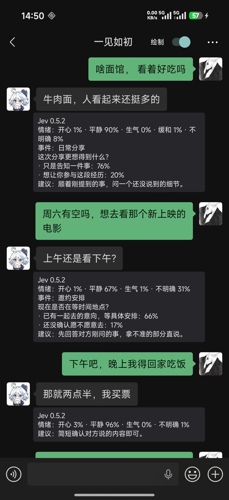
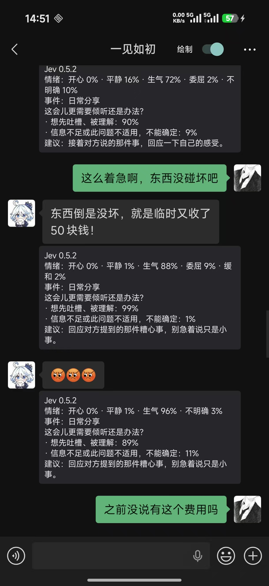

<div align="center">

# 言外 · Yanwai

**聊天里的言外之意，多一个理解的角度。**

在微信文字气泡下，结合前文展示情绪概率、可能的潜台词与一句沟通建议。


[使用效果](#使用效果) · [开始使用](#开始使用) · [接口配置](#接口配置) · [开发与构建](#开发与构建)

</div>

## 它能帮你做什么

“上午还是下午？”可能是在等一个具体安排；遇到糟心事时，对方可能更想先被听见。言外把这些可能性展示在消息旁边，供你参考。

- **结合上下文理解**：分析当前可见的对方纯文本，参考同一会话中之前最多 10 条合格文字消息。
- **展示概率，而非单一标签**：保留开心、平静、生气等情绪的概率，信息不足时也会体现不确定性。
- **分别判断解读与行动**：内置 8 类场景、32 套分析卡，覆盖日常分享、邀约、关心、玩笑、约定、委屈、修复与收尾。
- **直接显示在聊天里**：分析卡附在文字气泡下，右上角「绘制」开关可以随时隐藏。
- **选择自己的模型渠道**：支持 Jev 官方、OpenRouter、Vercel AI Gateway，选择渠道后填入对应 Key，APK 不携带个人密钥。

言外不会自动回复或发送微信消息。模型推测只提供一种理解角度，不能代表对方的真实想法。

## 使用效果

<table>
  <tr>
    <th width="50%">日常分享与邀约安排</th>
    <th width="50%">倾诉与情绪理解</th>
  </tr>
  <tr>
    <td align="center"><a href="docs/images/chat-sharing-and-plans.jpg"></a></td>
    <td align="center"><a href="docs/images/chat-listening-and-emotions.jpg"></a></td>
  </tr>
  <tr>
    <td>从分享一件小事，到确认时间，建议随对话进展变化。</td>
    <td>结合对方正在说的遭遇，判断是否更需要倾听与理解。</td>
  </tr>
</table>

以上为作者提供的实机使用截图，拍摄于 **0.5.2**，点击可查看原图。当前版本为 **1.1.4**，设置页改为状态概览、下一步引导和分区配置，支持浅深色及明确的保存/检测反馈，并保留微信内日志导出、多渠道接入和更新提醒；截图中的旧版本文字保留原样。

## 开始使用

### 使用条件

- Android **9 或更高版本**。
- 已配置可用的 **LSPosed / Xposed** 环境；仅安装 APK 不会自动生效。
- 自己的 **TypeSafe、OpenRouter 或 Vercel AI Gateway Key**，以及可访问所选接口的网络。
- 项目已有实机记录的微信版本为 **8.0.71**，其他版本的界面适配需实际验证。

### 安装与配置

1. 安装 APK，先从桌面打开一次 **「言外」**。
2. 选择 **模型渠道**，点击 **「申请 API Key」** 按页面步骤申请，粘贴 Key 后点击 **「保存并检测连接」**。预设渠道自动匹配地址和模型。
3. 在 LSPosed 中启用模块，作用域选择 **微信**。
4. **彻底退出并重新打开微信**。更新 APK 后也需要重启微信进程。
5. 打开聊天，查看对方文字气泡下的分析卡。

源码构建出的试用包位于 `app/build/outputs/apk/debug/app-debug.apk`，构建步骤见下文。

微信已加载设置后，可以划掉最近任务中的「言外」，当前微信进程会保留设置，已由用户在手机上确认可用。微信自身重启后仍需重新读取设置，若连接失败请打开一次言外。其他机型仍需验证，机制与验收步骤见[后台运行说明](docs/BACKGROUND.md)。

### 常用操作

从 1.1.2 开始，打开言外会检查 GitHub 正式新版（正常每 24 小时一次），也可点击“检查更新”。发现新版后前往 GitHub 下载 APK 覆盖安装；同一版本只自动提醒一次。无需自己的服务器。旧版用户需先手动升级以获得此功能，发布规则见[更新提醒说明](docs/UPDATES.md)。

| 操作 | 效果 |
| --- | --- |
| 关闭聊天右上角「绘制」 | 隐藏分析卡，保留原消息布局 |
| 长按「绘制」 | 打开状态、分析本屏和助手设置 |
| 关闭言外中的「启用分析」 | 停止发起新分析请求 |
| 微信「我 → 设置 → 言外」 | 打开助手设置 |
| 保存新的地址或 Key | 后续新请求使用新配置，已有缓存不会自动重做 |

## 接口配置

| 渠道 | 完整调用地址 | 模型 |
| --- | --- | --- |
| Jev 官方 · TypeSafe | `https://api.typesafe.ai/v1/systemone` | `jev-1.13.0` |
| OpenRouter | `https://openrouter.ai/api/v1/systemone` | `typesafe/jev-1.13` |
| Vercel AI Gateway | `https://ai-gateway.vercel.sh/typesafe/v1/systemone` | `typesafe-ai/jev` |
| 自定义 Jev 兼容接口 | 用户填写完整地址 | 按服务商填写，默认 `jev-1.13.0` |

页面随渠道展示三步申请教程、申请入口和官方接入文档。OpenRouter 无需另申请 TypeSafe Key；Vercel 需创建 **AI Gateway Key**，并按平台要求完成绑卡验证。完整教程见 [渠道与 Key 申请](docs/API_PROVIDERS.md)。

升级时会识别旧版保存的官方渠道常见地址，自动匹配 Jev 路径与模型，保留 Key。切换渠道分别保存各自的 Key，不将上一渠道的 Key 自动带到新渠道；切换后需保存生效。已有缓存不自动重做。

**自定义服务需要兼容 Jev 专用请求与概率响应协议，普通 OpenAI 聊天接口不能直接使用。** 自定义完整 HTTP(S) 地址不补路径；建议使用 HTTPS，HTTP 在微信进程中受宿主策略限制。连接检测运行内置中文示例的实际分析流程，不读取聊天；检测成功不代表微信模块已经加载。

## 分析范围与隐私

- 只为**当前屏幕可见的对方纯文本**发起分析，单条超过 **1000 字符**会跳过。
- 参考目标消息之前最多 10 条合格文字，不扫描聊天数据库或整段历史。图片、语音及其转写、文件、视频、链接和引用卡片等不参与分析。
- 启用分析后，**目标文字及相关前文会发送到你填写的模型接口地址**，请使用自己信任的服务。
- Key 保存在应用私有设置中，关闭系统备份；仅本应用和微信进程可通过设置桥读取配置。APK 不包含用户 Key，应用状态和日志不输出 Key。
- 聊天原文和分析结果不持久化；分析缓存仅保存在进程内存中。
- 没有足够依据时，可以只展示情绪概率，不强行添加潜台词或通用建议。

## 开发与构建

项目使用 Kotlin、Android 原生界面、Xposed 和 DexKit。编译环境：**JDK 17+、Gradle 8.9、Android SDK 35**。

配置 `ANDROID_HOME` 或在本机 `local.properties` 中设置 `sdk.dir`，然后在项目根目录运行：

```shell
 gradle :app:testDebugUnitTest :app:assembleDebug :app:lintDebug --no-daemon
 gradle :app:assembleRelease --no-daemon
```

仓库也提供 Windows 快捷脚本 `tools/gradle.ps1`，目前使用作者本机的 `D:\DevEnv\Java\jdk21` 和 `D:\DevEnv\gradle` 路径，其他环境请修改路径或直接使用上面的 Gradle 命令。

| 产物 | 路径 |
| --- | --- |
| 可安装的 Debug 试用包 | `app/build/outputs/apk/debug/app-debug.apk` |
| 未签名的 Release 包 | `app/build/outputs/apk/release/app-release-unsigned.apk` |

公开分发 Release 前，需用维护者自己的固定签名密钥签名。构建不读取个人 API 配置；签名文件、本机配置与临时输出已加入 Git 忽略。旧个人版 APK 曾内置 Key，不要公开分发旧包。

1.1.0 的 OpenRouter 已用真实 Key 完成三组中文样例、共六次请求的两轮分析。Vercel 已按官方接口接入并收到平台响应，当前测试账户受绑卡验证限制，尚未验证成功推理。构建及回归记录见[验证记录](docs/VERIFY.md)；自动化检查不代表所有微信版本均兼容。

## 常见问题

**没有分析卡？**

先确认 LSPosed 已启用模块且作用域选中了微信，再彻底重启微信。检查言外是否保存了有效 Key，以及「启用分析」和「绘制」是否打开。未知消息布局会跳过，不会强行覆盖原消息。

**隐藏绘制会停止请求吗？**

不会。绘制开关控制显示；要停止新请求，请关闭「启用分析」。已经发出的请求可能继续返回。

**为什么有时只有情绪，没有潜台词和建议？**

解读和下一步动作分别判断。没有可靠选项时只展示情绪概率，避免为了填满卡片而猜测。

**如何反馈问题？**

通过 [Issues](https://github.com/YIRC99/yanwai/issues) 提供 Android、微信和模块版本，以及复现步骤。附图和日志前请去掉私人聊天与密钥。

## 进一步了解

- [分析机制与实现说明](docs/TECHNICAL.md)
- [聊天模板与动作库](docs/CHAT_TEMPLATES.md)
- [版本验证记录](docs/VERIFY.md)
- [运行日志导出与开关保存失败排查](docs/DIAGNOSTICS.md)
- [气泡内绘制的适配风险](docs/INLINE_RENDERING_RISK.md)

## 致谢

- **Jev**：提供结构化选择与概率判断能力。
- **LSPosed / Xposed、DexKit**：提供模块运行与微信适配所需能力。
- [WeKit](https://github.com/Ujhhgtg/WeKit)：新版消息 View 监听与消息模型适配的重要参考。

本项目为独立开发的第三方模块，与微信官方无隶属关系。
