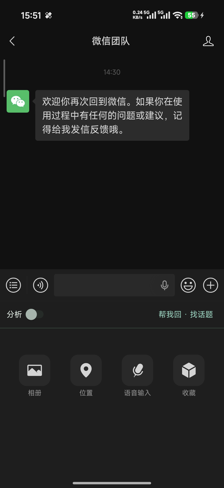
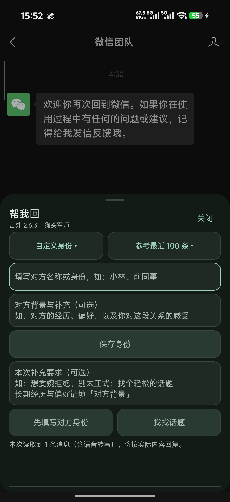
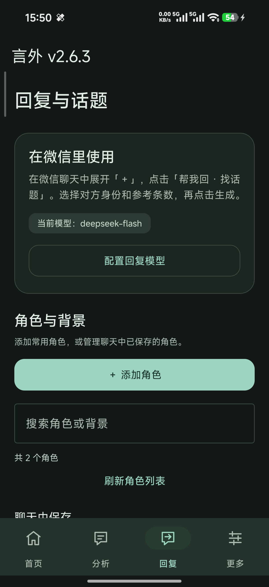
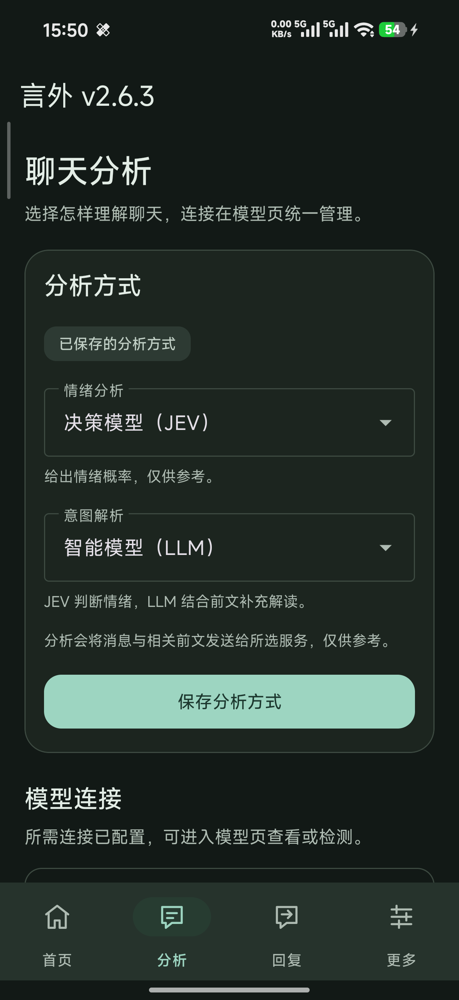
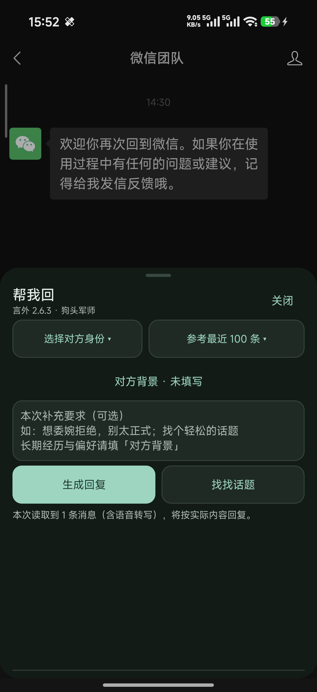

# 言外 2.6.3 宣传文案

## 朋友圈

最近把「言外」又整理了一轮。

微信里点开「＋」，就能分析消息、帮我回、找话题。现在也能记住对方的身份和背景，不用每次从头补充；这一次想怎么回，单独写就行。

设置页也重新理顺了，分析和回复可以按需要配置。

它帮你多一个理解和表达的角度，最后说什么、发不发，还是你决定。

2.6.3 试用包已整理好。免费开源，需要 Android + LSPosed / Xposed 和自己的模型 API。效果和入口放在图里，欢迎试试。

## 图文文章

# 对方是谁，不用每次从头说起

你有没有遇到过这种情况：想请 AI 帮你回一句话，结果每次都得先解释「他是我的前同事」「我们平时说话比较直接」「这次我想委婉拒绝」。

言外最近几轮更新，主要是在把这些步骤理顺。2.6.3 把新入口和使用方式整理到了一起。

### 打开「＋」，常用功能就在这里

聊天里展开「＋」，左侧「分析」控制当前聊天的自动分析，右侧「帮我回 · 找话题」打开回复面板。想用回复建议，不需要先开启自动分析。

### 长期背景记下来，本次要求单独写

进入「帮我回」，选择自定义身份。对方是谁、沟通习惯、相处经历，都可以作为长期背景保存；不必先生成回复，也能直接点「保存身份」。

比如「以前一起共事，说话比较直接」属于长期背景；「这次想拒绝邀约，但别太生硬」属于本次要求。这两个例子是虚构说明，不是截图中的聊天内容，也不是模型输出。

### 常用角色，在一个地方管理

在言外「回复」页，可以添加、搜索、查看、编辑和删除角色，也能管理聊天里已经保存的身份与背景。回到微信，主动选择后再用于当前联系人。

角色库和已经保存给联系人的资料是分开的：修改角色模板，不会悄悄覆盖已经保存的联系人背景。

### 分析和回复，按自己的需要配置

分析支持 JEV 和 LLM 两类来源。JEV 提供情绪概率，纯 LLM 提供文字判断，也可以复用回复模型的配置。连接统一到模型配置页管理，先选自己要用的功能就好。

### 最后一句，还是由你决定

言外继续提供手动生成、逐条复制的方式。你看完建议，自己粘贴、自己发送。模型的理解只是一个参考，不能代表对方真正的想法。

言外免费开源，需要 Android 9+ 和 LSPosed / Xposed 环境，模型接口与 API Key 由你配置。相关聊天和背景会在分析或生成时发给你所选的模型服务；模型服务可能收费。

本组截图来自 2.6.3 与微信 8.0.71，使用系统欢迎消息演示入口，没有使用私人聊天，也没有展示模型生成效果。升级后请重启微信。

## 发布搭配

- 朋友圈图文：配六张宣传图，顺序从 01 到 06。
- 朋友圈视频：使用竖版 MP4，已有中文字幕和本地合成旁白，不需要另加音乐。
- GitHub Release：使用 `docs/releases/2.6.3.md`；附上 APK 和 SHA256SUMS.txt。发布前在 GitHub 编辑器上传宣传图并替换正文的相对图片路径，或使用交付目录中的纯文本 `GitHub-Release.txt`，无需图片路径替换。
- 宣传只讲实际能力；不要把 356 项离线测试写成所有手机都已兼容，也不要把入口截图写成模型效果实测。
